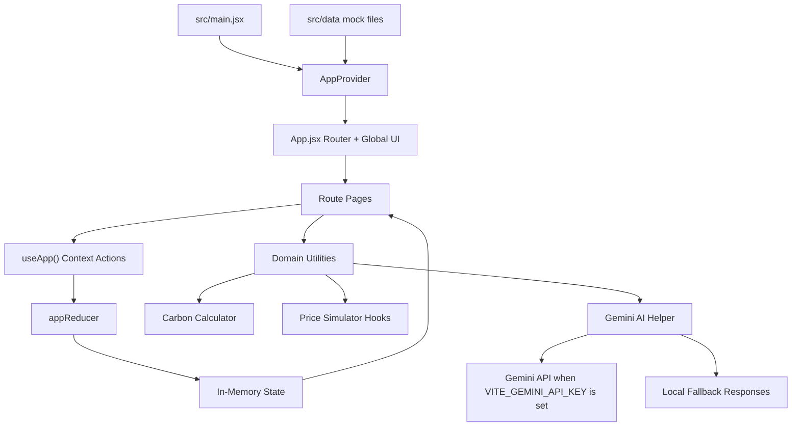

# CarbonX App Architecture

## Overview

CarbonX is a client-side React application for a carbon credit marketplace. It demonstrates role-based login, farmer/NGO project submission, AI-style verification, credit wallet updates, company purchasing, marketplace filtering, dashboards, notifications, achievements, and simulated live market pricing.

The current app is a Vite single-page application. There is no backend service in this repository; persistence, authentication, projects, marketplace listings, transactions, notifications, and users are all modeled in memory from mock data files.

## Technology Stack

- **Build/runtime:** Vite with React 19.
- **Routing:** `react-router-dom` with browser routes declared in `src/App.jsx`.
- **State management:** React Context plus `useReducer` in `src/context/AppContext.jsx`.
- **Styling:** Tailwind CSS v4 imported through `src/index.css`, with custom theme colors and animation keyframes.
- **Charts:** Recharts for dashboards, market charts, wallet charts, and analytics.
- **Icons:** `lucide-react`.
- **Map support:** `@react-google-maps/api` is installed and used by map-related components.
- **AI integration point:** Gemini API helper in `src/utils/geminiAI.js`, with local fallback responses when no API key is configured.

## Entry Point and App Shell

The app starts in `src/main.jsx`. It creates the React root, imports global CSS, wraps the application with `AppProvider`, and renders `App`.

`src/App.jsx` is the main shell. It defines:

- The browser router.
- Route-to-page mappings.
- A lightweight loading overlay during route transitions.
- Global keyboard shortcuts.
- Global UI surfaces such as toast notifications, notification center, global search, achievement popup, demo controller, and keyboard shortcuts modal.
- Error boundaries around most pages.

The route tree is flat and page-oriented:

| Route | Page |
| --- | --- |
| `/` | Landing page |
| `/login` | Role-based login |
| `/onboarding` | New-user onboarding |
| `/dashboard/farmer` | Farmer/NGO dashboard |
| `/dashboard/company` | Company dashboard |
| `/dashboard/admin` | Admin dashboard |
| `/submit-project` | Project submission wizard |
| `/wallet` | Credit wallet |
| `/marketplace` | Carbon credit marketplace |
| `/watchlist` | Saved marketplace listings |
| `/analytics` | Analytics dashboard |
| `/leaderboard` | Gamified leaderboard |
| `/emissions-calculator` | Company emissions calculator |
| `/demo-check` | Demo checklist |

## State Architecture

Global state lives in `src/context/AppContext.jsx`.

The provider initializes state from the mock data layer:

- `mockUsers`
- `mockProjects`
- `mockMarketplace`
- `mockTransactions`

The reducer manages these main domains:

- `currentUser`
- `wallet`
- `projects`
- `marketplace`
- `transactions`
- legacy toast notifications
- rich notifications
- notification center UI state
- price alerts
- activity feed
- onboarding state
- watchlist
- achievements

Pages and shared components consume this state through the `useApp()` hook. Actions are exposed as provider methods, such as:

- `login`
- `logout`
- `submitProject`
- `buyCredits`
- `addNotification`
- `addRichNotification`
- `markAllRead`
- `toggleNotificationCenter`
- `addPriceAlert`
- `triggerPriceAlert`
- `completeOnboarding`
- `toggleWatchlist`
- `resetDemo`

Because the app state is held in memory, a page refresh resets the app back to the mock initial state.

## Data Layer

The app uses static JavaScript data files under `src/data`.

- `mockUsers.js` defines farmers, NGOs, companies, and admin users. It includes demo credentials, roles, wallet balances, project counts, emissions data, and onboarding flags.
- `mockProjects.js` defines submitted projects with project type, owner, status, location, generated credits, and descriptive metadata.
- `mockMarketplace.js` defines listed carbon credits with seller details, project type, available credits, price per credit, rating, and location.
- `mockTransactions.js` defines wallet and marketplace transaction history.
- `onboardingData.js` supports the onboarding flow.

This mock layer acts like an in-browser database for the demo. Mutations are reducer updates only; they are not written back to disk or sent to a server.

## Domain Utilities

Core domain logic is kept in `src/utils`.

### Carbon Calculator

`src/utils/carbonCalculator.js` calculates estimated carbon credits:

- Tree plantation: `(treesPlanted * 0.02) + (landArea * 0.5)`
- Soil carbon: `landArea * 1.2`
- Renewable energy: `landArea * 2.0`

The utility returns credits, CO2 saved in kilograms, and the methodology label.

### Price Simulator

`src/utils/priceSimulator.js` provides React hooks for simulated market data:

- `usePriceSimulator()` generates a rolling price history and updates it every three seconds.
- `useMultiPriceSimulator()` runs separate simulations for tree, soil, and renewable credit categories.

These hooks drive the live price chart, marketplace ticker, and wallet price displays.

### Gemini AI Helper

`src/utils/geminiAI.js` centralizes AI calls:

- `verifyProject(projectData)`
- `getAIRecommendation(userRole, location, currentCredits)`
- `generateMarketInsight()`

It reads `VITE_GEMINI_API_KEY` from the Vite environment. If the key is missing or the API call fails, it returns deterministic fallback content so the demo still works offline.

## Main User Flows

### Login and Role Routing

`LoginPage.jsx` reads the selected role from UI state or `?role=` query parameters. It checks credentials against `mockUsers`, simulates an authentication delay, dispatches `login`, and redirects based on role:

- Farmer or NGO: `/dashboard/farmer`
- Company: `/dashboard/company`
- Admin: `/dashboard/admin`
- New users: `/onboarding`

This is demo authentication only. Password checks happen on the client against mock data.

### Project Submission

`ProjectSubmission.jsx` implements a three-step wizard:

1. Project details and location.
2. Impact data such as trees, land area, farming practice, or renewable capacity.
3. Upload preview and AI verification.

The page calculates estimated credits with `calculateCredits()`, calls `verifyProject()` for an AI-style verification report, and then calls `submitProject()` from context.

`submitProject()` adds the project as pending, shows notifications, and after a timeout simulates verification by marking it verified and adding credits to the wallet.

### Marketplace Purchase

`Marketplace.jsx` reads listings from `mockMarketplace`, filters and sorts them locally, supports grid/list views, watchlist toggling, live pricing widgets, and an AI market insight.

When a user buys credits, `buyCredits()`:

- Decreases `creditsAvailable` on the selected listing.
- Creates a new transaction.
- Adds purchased credits to the current wallet balance.
- Adds toast and rich notifications.
- Checks achievement unlocks.

### Notifications and Activity

The notification system has two layers:

- Legacy toast notifications for immediate lightweight feedback.
- Rich notifications for the notification center.

`NotificationCenter.jsx` also handles price alerts and a simulated activity feed. Activity items are stored in context and capped to the latest 50 entries.

### Dashboards and Analytics

Dashboard pages combine mock data, context state, Recharts visualizations, AI recommendations, and shared components.

- Farmer dashboard focuses on project portfolio, wallet status, recommendations, and progress.
- Company dashboard focuses on offset needs and purchases.
- Admin dashboard focuses on platform/project oversight.
- Analytics dashboard provides broader platform metrics.

## Component Organization

The app is organized around page components and reusable UI/domain components.

`src/pages` contains route-level screens. These components coordinate navigation, local UI state, filtering, charts, and calls into `useApp()`.

`src/components` contains shared widgets such as:

- Navigation
- Toasts
- Notification center
- Marketplace cards and filters
- Price ticker and live price chart
- Project map and detail panel
- Certificate generator
- Global search
- Demo controller
- Error boundary
- Skeleton loaders
- Achievement popup

Most components are UI-focused and receive data through props or `useApp()`.

## Styling Architecture

Styling is mostly inline Tailwind utility classes inside JSX. Global styles in `src/index.css` define:

- Tailwind import.
- Theme colors like `carbon`, `forest`, `leaf`, `credit`, and `success`.
- Shared animation keyframes.
- Custom scrollbar styling.
- Global search and dual-range-slider helpers.

There is no separate component library or design token package. The visual language is encoded directly in component classes and a small global theme.

## External Boundaries

The current app has only one real external service boundary:

- Gemini API through `fetch()` in `src/utils/geminiAI.js`.

Everything else is local and simulated:

- Auth is mock-user lookup.
- Database is static JS data plus reducer state.
- Carbon credit verification is AI fallback/simulation unless Gemini is configured.
- Live pricing is random walk simulation.
- Transactions are in-memory reducer records.
- Blockchain, IoT, and satellite verification concepts appear in product copy and demo logic, but are not implemented as real integrations in this codebase.

## High-Level Flow Diagram

## Important Limitations

- No backend API or persistent database exists in this repository.
- No real authentication, authorization, or session persistence exists.
- Environment variables are exposed to the client because this is a Vite frontend app.
- Marketplace prices and live feeds are simulated.
- Purchases and wallet balances reset on reload.
- AI verification is best understood as a demo integration point, not a production verification pipeline.

## Where to Extend Next

For a production architecture, the most important next steps would be:

- Move authentication to a backend or identity provider.
- Replace mock data with API-backed persistence.
- Add server-side validation for project submissions and purchases.
- Store transactions in a durable ledger.
- Move Gemini calls behind a backend endpoint so API keys are not exposed to the browser.
- Add tests around reducer actions, marketplace purchase behavior, project submission, and calculator formulas.
