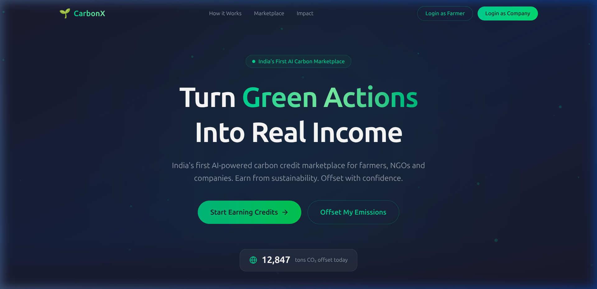
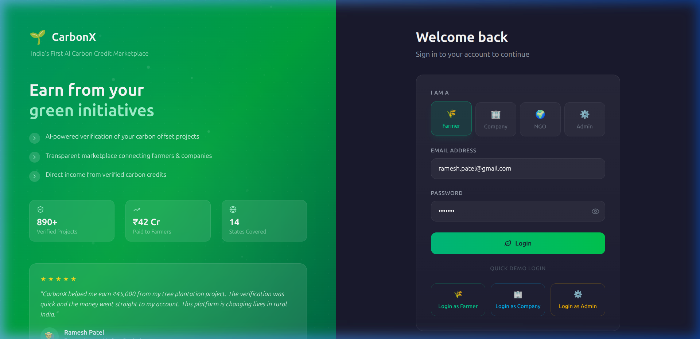
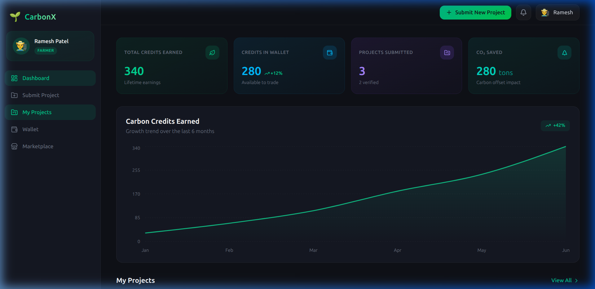
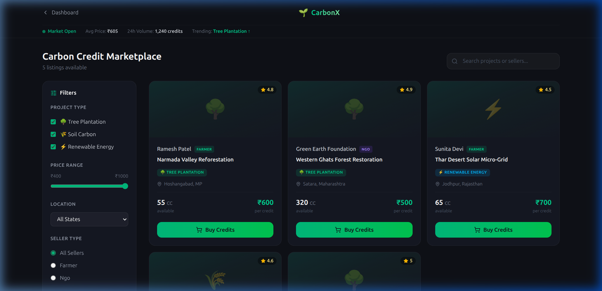
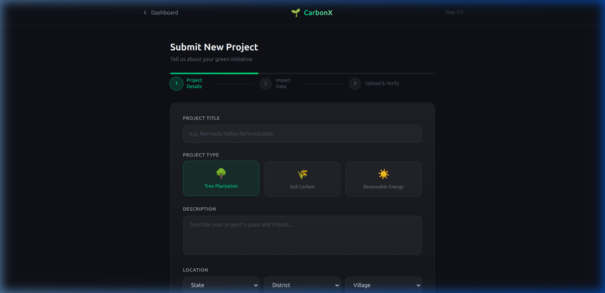
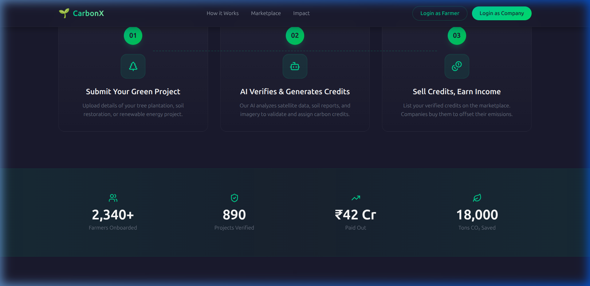
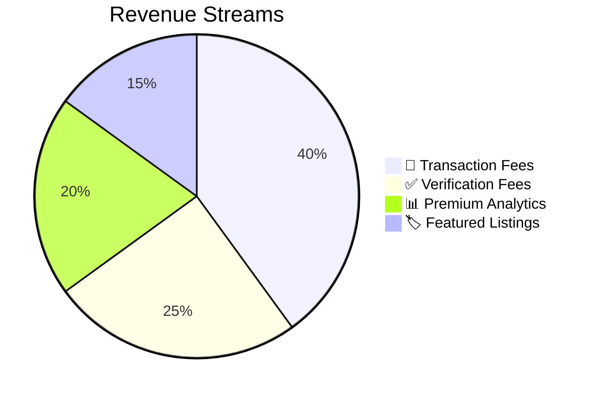
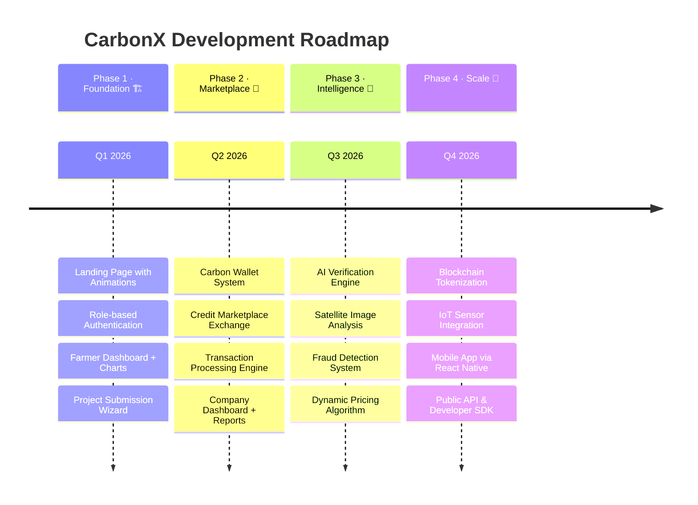

<div align="center">

<!-- Animated SVG Banner -->


<!-- Animated Typing SVG -->
<a href="https://git.io/typing-svg"></a>

<br/>
<br/>

<!-- Tech Stack Badges -->
<p>


</p>

<!-- Repo Stats -->
<p>


</p>

<br/>


</div>

<br/>

## 🎯 The Problem We're Solving

> Climate change is accelerating. Industries and transportation generate massive carbon emissions daily. Meanwhile, **farmers and NGOs** doing positive environmental work — planting trees, restoring soil, reducing emissions — receive **no financial reward** for their impact.

**CarbonX** bridges this gap. It's a **digital carbon credit exchange** — like a stock market for sustainability. People who reduce or capture carbon earn credits stored in a digital wallet, which companies can buy to offset their own footprint. Everyone wins. The planet wins.

<br/>

<div align="center">

</div>

<br/>

## 📸 Live Preview

<div align="center">

### 🏠 Landing Page — Hero Section

<p><em>Animated particle background • Live CO₂ offset counter • Dual CTA for farmers & companies</em></p>

<br/>

### 🔐 Authentication — Role-Based Login

<p><em>Split-screen layout • 4 role types (Farmer, Company, NGO, Admin) • Quick demo login shortcuts • Social proof sidebar</em></p>

<br/>

### 📊 Farmer Dashboard — Analytics & Portfolio

<p><em>Real-time KPI cards • Interactive Recharts area graph • Credit growth tracking (+42%) • Project portfolio manager</em></p>

<br/>

### 🛒 Carbon Credit Marketplace

<p><em>Live market ticker • Advanced filtering (type, price, location, seller) • Star ratings • Real-time ₹ pricing</em></p>

<br/>

### 📋 Project Submission — Multi-Step Wizard

<p><em>3-step guided wizard • Visual project type selector • State/District/Village location picker • Progress indicator</em></p>

<br/>

### 📈 How It Works & Impact Stats

<p><em>3-step visual flow • Glassmorphism cards • Impact counters: 2,340+ Farmers • 890 Projects • ₹42 Cr Paid • 18,000 Tons CO₂</em></p>

</div>

<br/>

<div align="center">

</div>

<br/>

## 🏗️ System Architecture

```mermaid
graph TB
    subgraph Client["🖥️ Frontend · React 19 + Vite 8"]
        direction LR
        LP["🏠 Landing"]
        AUTH["🔐 Auth"]
        DASH["📊 Dashboards"]
        MKT["🛒 Marketplace"]
        WAL["💰 Wallet"]
        SUB["📋 Submit"]
    end

    subgraph StateLayer["⚙️ State · Context + useReducer"]
        direction LR
        CTX["AppContext"]
        RED["Reducer Actions"]
        MOCK["Mock Data Layer"]
    end

    subgraph AIEngine["🤖 AI Engine"]
        direction LR
        SAT["🛰️ Satellite\nVerification"]
        SOIL["🌍 Soil Carbon\nPrediction"]
        FRAUD["🔍 Fraud\nDetection"]
        PRICE["💹 Dynamic\nPricing"]
        REC["💡 Smart\nRecommendations"]
    end

    subgraph Infra["🔗 Infrastructure"]
        direction LR
        BC["⛓️ Blockchain\nTokenization"]
        IOT["📡 IoT\nSensors"]
        SAT2["🛰️ Satellite\nMonitoring"]
    end

    Client -->|"dispatch actions"| StateLayer
    StateLayer -->|"API calls"| AIEngine
    AIEngine -->|"verified data"| Infra

    style Client fill:#064e3b,stroke:#10b981,color:#fff,stroke-width:2px
    style StateLayer fill:#1e3a5f,stroke:#3b82f6,color:#fff,stroke-width:2px
    style AIEngine fill:#4c1d95,stroke:#a78bfa,color:#fff,stroke-width:2px
    style Infra fill:#78350f,stroke:#f59e0b,color:#fff,stroke-width:2px
```

<div align="center">



</div>

<br/>

<div align="center">

</div>

<br/>

## ✨ Feature Matrix

<div align="center">

| Feature | Farmer 🌾 | Company 🏢 | NGO 🌳 | Admin 🛡️ |
|:--------|:---:|:---:|:---:|:---:|
| Submit Green Projects | ✅ | — | ✅ | — |
| Earn Carbon Credits | ✅ | — | ✅ | — |
| Buy Credits on Marketplace | — | ✅ | — | — |
| Sell Credits on Marketplace | ✅ | — | ✅ | — |
| Analytics Dashboard | ✅ | ✅ | ✅ | ✅ |
| Digital Carbon Wallet | ✅ | ✅ | ✅ | — |
| AI Project Verification | ✅ | — | ✅ | ✅ |
| Emission Tracking & Reports | — | ✅ | — | ✅ |
| Fraud Detection Alerts | — | — | — | ✅ |
| Smart Recommendations | ✅ | ✅ | ✅ | — |
| Platform Governance | — | — | — | ✅ |

</div>

<br/>

<div align="center">

</div>

<br/>

## 🤖 AI & Advanced Technology Stack

<table>
<tr>
<td width="50%" valign="top">

### 🧠 Artificial Intelligence

| Module | What It Does |
|:---|:---|
| 🛰️ **Satellite Image Analysis** | Verifies forests, plantations, and land use via satellite imagery |
| 🌍 **Soil Carbon Prediction** | ML models estimate carbon sequestered through farming practices |
| 🔍 **Fraud Detection** | Identifies fake projects, duplicate claims, and anomalies |
| 💹 **Dynamic Pricing** | Real-time credit valuation based on market supply & demand |
| 💡 **Recommendation Engine** | Suggests optimal practices to maximize credit earnings |

</td>
<td width="50%" valign="top">

### 🔗 Advanced Infrastructure

| Technology | Purpose |
|:---|:---|
| ⛓️ **Blockchain** | Tokenized carbon credits for transparency & immutability |
| 📡 **IoT Sensors** | Auto-collect soil moisture, temperature & organic carbon data |
| 🛰️ **Satellite Monitoring** | Continuous project verification via geospatial analysis |
| 🔐 **Role-Based Auth** | Secure multi-tenant access with 4 distinct user roles |
| 📊 **Real-time Analytics** | Interactive Recharts dashboards with live data feeds |

</td>
</tr>
</table>

<br/>

<div align="center">

</div>

<br/>

## 🧮 Carbon Credit Calculation Engine

Our credit engine implements **IPCC 2023 Standard** methodology:

> **1 Carbon Credit = 1 Metric Ton of CO₂** prevented from entering or removed from the atmosphere

```javascript
/**
 * IPCC 2023 Carbon Credit Calculator
 * Methodology: Intergovernmental Panel on Climate Change
 */

// 🌳 Tree Plantation Projects
credits = (treesPlanted × 0.02) + (landArea × 0.5)    // credits/year

// 🌾 Soil Carbon Sequestration
credits = landArea × 1.2                                // credits

// ⚡ Renewable Energy Projects
credits = landArea × 2.0                                // credits

// 📊 CO₂ Impact Estimation
co2_saved_kg = credits × 1000                           // kilograms of CO₂
```

<details>
<summary><b>📐 Calculation Examples</b></summary>
<br/>

| Project Type | Input | Credits Generated | CO₂ Saved |
|:---|:---|:---:|:---:|
| 🌳 Tree Plantation | 5,000 trees + 10 hectares | **105 CC** | 105,000 kg |
| 🌾 Soil Carbon | 25 hectares farmland | **30 CC** | 30,000 kg |
| ⚡ Renewable Energy | 15 hectares solar farm | **30 CC** | 30,000 kg |
| 🌳 Large Reforestation | 50,000 trees + 100 hectares | **1,050 CC** | 1,050,000 kg |

</details>

<br/>

<div align="center">

</div>

<br/>

## 🛤️ User Journey

```mermaid
graph LR
    A["🌐 Visit CarbonX"] --> B["🔐 Sign Up"]
    B --> C{"Choose Role"}
    C -->|"🌾 Farmer / NGO"| D["📋 Submit Project"]
    C -->|"🏢 Company"| H["🛒 Browse Marketplace"]
    D --> E["🤖 AI Verification"]
    E --> F["💰 Credits → Wallet"]
    F --> G["📊 Track & Sell"]
    H --> I["💳 Buy Credits"]
    I --> J["📈 Offset & Report"]
    G --> K["🌍 Planet Impact"]
    J --> K

    style A fill:#064e3b,stroke:#10b981,color:#fff
    style B fill:#064e3b,stroke:#10b981,color:#fff
    style C fill:#1e3a5f,stroke:#3b82f6,color:#fff
    style D fill:#064e3b,stroke:#10b981,color:#fff
    style E fill:#4c1d95,stroke:#a78bfa,color:#fff
    style F fill:#064e3b,stroke:#10b981,color:#fff
    style G fill:#064e3b,stroke:#10b981,color:#fff
    style H fill:#78350f,stroke:#f59e0b,color:#fff
    style I fill:#78350f,stroke:#f59e0b,color:#fff
    style J fill:#78350f,stroke:#f59e0b,color:#fff
    style K fill:#166534,stroke:#22c55e,color:#fff
```

<div align="center">



</div>

<br/>

<div align="center">

</div>

<br/>

## 💰 Revenue Model

<div align="center">



</div>

| Stream | Description | Model |
|:---|:---|:---|
| 🔄 **Transaction Fee** | Percentage charged on every credit trade | Per-transaction |
| ✅ **Verification Fee** | Charged when projects undergo AI verification | Per-project |
| 📊 **Premium Reports** | Advanced sustainability analytics for corporates | Subscription |
| 🏷️ **Featured Listings** | Priority marketplace placement for sellers | Pay-per-listing |

<br/>

<div align="center">

</div>

<br/>

## 📂 Project Structure

```
Carbon-Footprint-System/
│
├── 📄 index.html                      # App entry point
├── ⚡ vite.config.js                   # Vite bundler configuration
├── 🎨 tailwind.config.js              # Tailwind theme & custom tokens
├── 📦 package.json                    # Dependencies & scripts
├── 🔒 .env                           # Environment variables
│
├── 📁 docs/
│   └── 📁 screenshots/               # README preview images
│
├── 📁 public/                         # Static assets
│
└── 📁 src/
    ├── 🚀 main.jsx                    # Bootstrap with AppProvider
    ├── 🧭 App.jsx                     # React Router configuration
    ├── 🎨 index.css                   # Global styles + Tailwind
    │
    ├── 📁 pages/                      # Route-level components
    │   ├── 🏠 LandingPage.jsx         # Hero · Features · Stats · CTA
    │   ├── 🔐 LoginPage.jsx           # Multi-role auth with demo login
    │   ├── 🌾 FarmerDashboard.jsx     # KPIs · Charts · Project list
    │   ├── 🏢 CompanyDashboard.jsx    # Emission tracking & offsets
    │   ├── 🛡️ AdminDashboard.jsx      # Platform governance panel
    │   ├── 📋 ProjectSubmission.jsx   # 3-step guided project wizard
    │   ├── 💰 Wallet.jsx              # Carbon credit wallet
    │   └── 🛒 Marketplace.jsx         # Credit trading exchange
    │
    ├── 📁 context/
    │   └── 🔄 AppContext.jsx          # Global state (Context + useReducer)
    │
    ├── 📁 data/                       # Mock data layer
    │   ├── 📊 mockMarketplace.js      # Market listings & pricing
    │   ├── 📋 mockProjects.js         # Sample verified projects
    │   ├── 💳 mockTransactions.js     # Transaction history
    │   └── 👥 mockUsers.js            # User profiles & roles
    │
    ├── 📁 utils/
    │   └── 🧮 carbonCalculator.js     # IPCC 2023 credit engine
    │
    └── 📁 assets/                     # Images · Icons · Media
```

<br/>

<div align="center">

</div>

<br/>

## 🚀 Getting Started

### Prerequisites

| Tool | Version | Download |
|:---|:---|:---|
| **Node.js** | `≥ 18.0` | [nodejs.org](https://nodejs.org) |
| **npm** | `≥ 9.0` | Bundled with Node.js |
| **Git** | Latest | [git-scm.com](https://git-scm.com) |

### Installation

```bash
# 1️⃣  Clone the repository
git clone https://github.com/neonninja-9/Carbon-Footprint-System.git
cd Carbon-Footprint-System

# 2️⃣  Install dependencies
npm install

# 3️⃣  Set up environment variables (optional — for Google Maps)
echo "VITE_GOOGLE_MAPS_KEY=YOUR_KEY_HERE" > .env

# 4️⃣  Start the development server
npm run dev

# 5️⃣  Open in browser
# 🌐 http://localhost:5173
```

### Demo Credentials

> The app includes **Quick Demo Login** buttons for instant access:

| Role | Email | Password |
|:---|:---|:---|
| 🌾 Farmer | `ramesh.patel@gmail.com` | `demo123` |
| 🏢 Company | `sustainability@tatasteel.com` | `demo123` |
| 🌍 NGO | `contact@greenearthfdn.org` | `demo123` |
| 🛡️ Admin | `admin@carbonx.io` | `demo123` |

<details>
<summary><b>📦 All Available Scripts</b></summary>
<br/>

| Command | Description |
|:---|:---|
| `npm run dev` | 🔥 Start dev server with hot module replacement |
| `npm run build` | 📦 Create optimized production bundle |
| `npm run preview` | 👁️ Preview the production build locally |
| `npm run lint` | 🔍 Run ESLint code quality checks |

</details>

<br/>

<div align="center">

</div>

<br/>

## 🛠️ Tech Stack Deep Dive

<div align="center">

| Layer | Technology | Version | Role |
|:---:|:---:|:---:|:---|
| ⚛️ | **React** | 19.2 | Component-based UI with concurrent features |
| ⚡ | **Vite** | 8.0 | Sub-second HMR & optimized production builds |
| 🎨 | **Tailwind CSS** | 4.2 | Utility-first styling with dark mode & custom tokens |
| 📊 | **Recharts** | 3.8 | Interactive SVG charts & data visualizations |
| 🧭 | **React Router** | 6.30 | Declarative client-side routing |
| 🔮 | **Lucide React** | 1.12 | 1,000+ pixel-perfect SVG icons |
| 🧠 | **useReducer** | — | Predictable state transitions via action dispatch |
| 🔐 | **Context API** | — | Dependency injection & global auth state |

</div>

<br/>

<div align="center">

</div>

<br/>

## 🗺️ Roadmap

<div align="center">



</div>

<br/>

<div align="center">

</div>

<br/>

## 🌍 Environmental Impact

<div align="center">

| Metric | Value | Impact |
|:---|:---:|:---|
| 🌾 **Farmers Onboarded** | 2,340+ | Extra income beyond crop sales |
| ✅ **Projects Verified** | 890 | AI-validated sustainability initiatives |
| 💰 **Paid to Farmers** | ₹42 Cr | Direct financial rewards for green action |
| 🌍 **CO₂ Offset** | 18,000 tons | Real atmospheric carbon reduction |
| 📍 **States Covered** | 14 | Pan-India reach across rural communities |

</div>

<br/>

<div align="center">

</div>

<br/>

## 🤝 Contributing

We welcome contributions! Whether it's bug fixes, new features, or documentation improvements:

```bash
# 1. Fork the repository
# 2. Create your feature branch
git checkout -b feature/amazing-feature

# 3. Make your changes and commit
git commit -m "✨ feat: add amazing feature"

# 4. Push to your fork
git push origin feature/amazing-feature

# 5. Open a Pull Request 🎉
```

<details>
<summary><b>📝 Commit Convention</b></summary>
<br/>

| Emoji | Prefix | Usage |
|:---:|:---|:---|
| ✨ | `feat:` | New feature |
| 🐛 | `fix:` | Bug fix |
| 📚 | `docs:` | Documentation changes |
| 🎨 | `style:` | Code formatting (no logic change) |
| ♻️ | `refactor:` | Code restructure |
| 🧪 | `test:` | Adding or updating tests |
| ⚡ | `perf:` | Performance improvement |
| 🔧 | `chore:` | Build/tooling maintenance |

</details>

<br/>

<div align="center">

</div>

<br/>

## 📄 License

<div align="center">

Distributed under the **MIT License**. See [`LICENSE`](LICENSE) for details.

<br/>

---

<br/>

### 💚 Made with passion for a sustainable future

*CarbonX — where sustainability meets financial rewards*

<br/>

<!-- Animated Footer -->


<br/>

<a href="#top">

</a>

</div>
